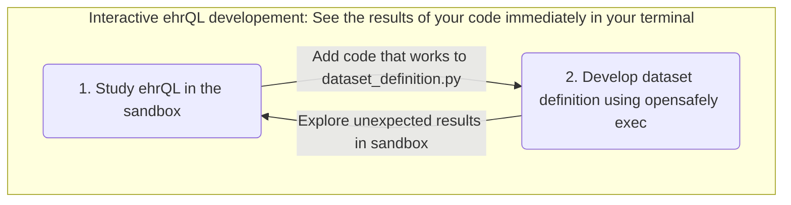
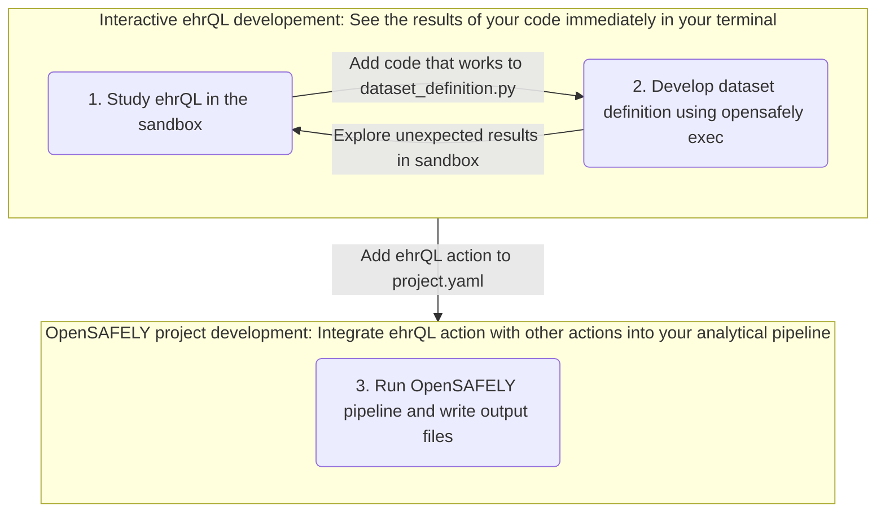

# ehrQL workflow

You are here because you want to develop your own project using ehrQL and have already worked through the tutorial and examples in the documentation.

This page documents suggestions on how to develop dataset definitions in ehrQL using different OpenSAFELY tools.
Some of these suggestions might be new to you, but we hope that they will make it easier to develop ehrQL queries for you project.
There are three main ways to run ehrQL queries, each comes with different advantages and is more or less usefull during different stages of your project development. 
The flowcharts below are simplified illustrations of how you can use these tools to develop your dataset definition. 

## Interactive development of an ehrQL action

1. **Sandbox:** Initially, it can be helpful to explore how you can construct ehrQL queries for your research project in the sandbox. The ehrQL sandbox lets you try out ehrQL queries against dummy data in an interactive Python console. **The sandbox is especially useful when learning ehrQL and at the beginning of your project development because you can exlore the results of individual ehrQL queries directly in the Python console.**

2. **opensafely exec:** Once you have found a way to express the population for your project you can start integrating this to your `dataset_definition.py` file that was provided by the research template. 
   At this stage you might benefit from a quick feedback loop that shows you the outputs directly in the console so you can chech that your code works as intended. **Using `opensafely exec` is very useful when developing a single dataset definition because you can inspect the ouput of your dataset definition directly in your terminal.**

## Integrating an ehrQL action to the OpenSAFELY pipeline

3. **OpenSAFELY pipeline:** Finally, when you're happy with your dataset definition you can add it to the `project.yaml` file and itegrate it with other actions in your OpenSAFELY pipeline. The feedback loop of this option is slower compared to the other options because output files are written to disk instead of being returned in the terminal.

# About the OpenSAFELY framework

The OpenSAFELY framework is a Trusted Research Environment (TRE) for electronic
health records research in the NHS, with a focus on public accountability and
research quality.

Read more at [OpenSAFELY.org](https://opensafely.org).

# Licences
As standard, research projects have a MIT license. 
