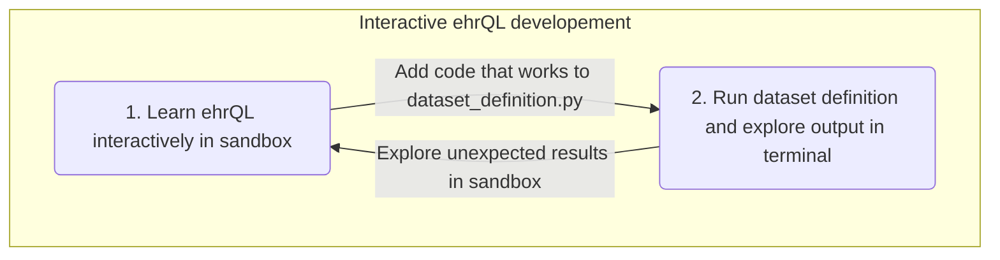
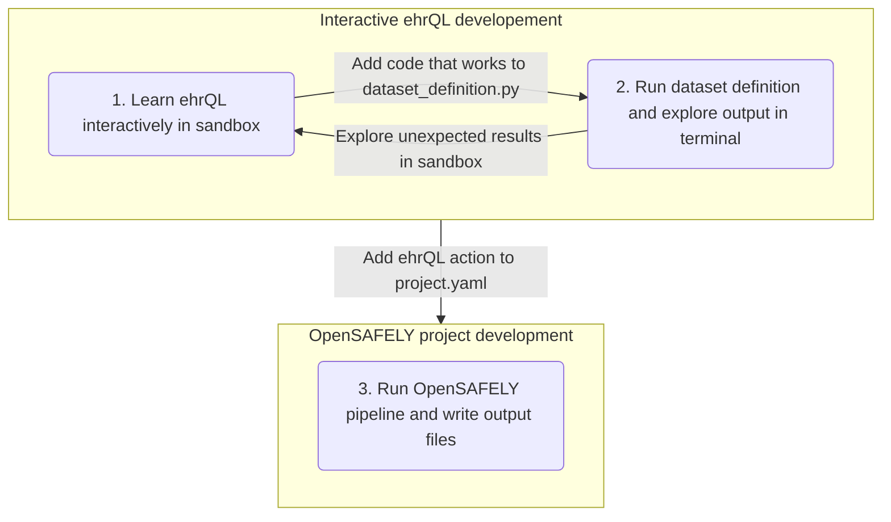

# ehrQL workflow

You are here because you want to develop your own project using ehrQL and have already worked through the examples in the documentation.

This page documents suggestions on how to develop dataset definitions in ehrQL using different OpenSAFELY tools.
Some of these suggestions might be new to you, but we hope that they will make it easier to write ehrQL scripts that work and do exactly what you need.
There are three main ways to run ehrQL code, each comes with different advantages and is more or less usefull during different stages of your project development. 

## Three different ways to run ehrQL

1. **Sandbox:** Learn how ehrQL works interactively: 
   The ehrQL sandbox lets you try out ehrQL queries against dummy data in an interactive Python console.
   Useful at the beginning to learn how ehrQL code behaves and to explore how more complex queries can be constructed.
   To work with the sandbox you have to (1) download some dummy data and then (2) start the sandbox:
      
   `opensafely exec ehrql:v0 sandbox example-data`

2. **opensafely exec:** Develop an ehrQL dataset definition interactively and explore the output in terminal: 
   Very quick feedback loop because outputs are shown directly in the console and therefore helpful during the development of an individual ehrQL action.
   Less helpful when working on multiple actions that are dependend on each other and require up to date output files.

   When using `opensafely exec` to run your dataset defnition you need to specify that you're using ehrQL, the command, and the path to the Python file with your dataset definition:

   `opensafely exec ehrql:v0 generate-dataset analysis/dataset_definition.py`

3. **OpenSAFELY pipeline:** Run an ehrQL dataset definition through the OpenSAFELY pipeline and write output files:
   Slower feedback loop because output files are written to disk instead of being returned in the terminal.
   Useful when intetrating the new ehrQL action to your OpenSAFELY pipeline with further downstream analysis scripts. 
   You need to specify an action in the `project.yaml` file of your project before you can run your new action using:

   `opensafely run generate_dataset`

## Interactive development of an ehrQL action

The flowchart below is a simplified illustration of how you can use these tools to develop your dataset definition. 

1. **Sandbox:** Initially, it can be helpful to explore how you can construct ehrQL queries for your research project in the sandbox.

2. **opensafely exec:** Once you have found a way to express the population for your project you can start integrating this to the `dataset_definition.py` file that was provided by the research template.
   At this stage you might benefit from a quick feedback loop that shows you the outputs directly in the console so you can chech that your code works as intended (e.g., variable names, calculations).

## Integrating an ehrQL action to the OpenSAFELY pipeline

3. **OpenSAFELY pipeline:** Finally, when you're happy with your dataset definition you can add it to the `project.yaml` file and itegrate it with other actions in your OpenSAFELY pipeline. For example, ...

## TODO

- [ ] Multiple terminals, e.g., one for each tool 
  - Add screenshots
  - Add to .vscode settings or tasks so that it works the same for everyone within GitHub Codespaces/VSCode 
- [ ] Interactive developement of an analysis action in R or Python

# About the OpenSAFELY framework

The OpenSAFELY framework is a Trusted Research Environment (TRE) for electronic
health records research in the NHS, with a focus on public accountability and
research quality.

Read more at [OpenSAFELY.org](https://opensafely.org).

# Licences
As standard, research projects have a MIT license. 
